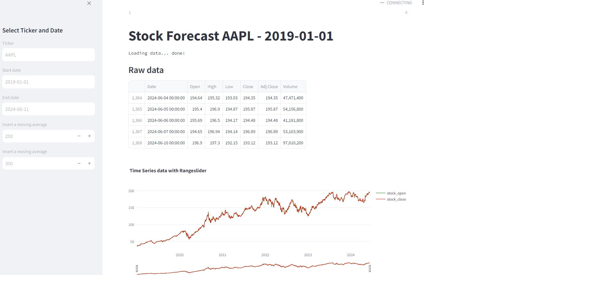
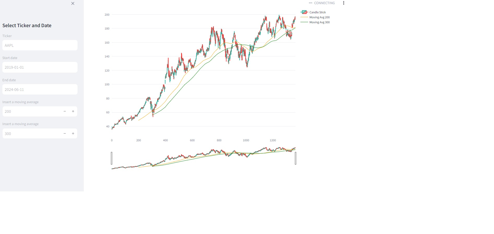

### Stock Prediction Web App

- Streamlit is used for web app
- Yahoo Finance for stock data
- Facebook prophet to predict stock prices in future [Visit <a href='https://facebook.github.io/prophet'>Facebook Prophet</a>]
- A dropdown of determined stock
- Raw data to analyze
- Interactive time series data with zoom in/out
- Forecast data for a year from 2015
- Analyze weekly trends
- Analyze yearly trends
  
#### Streamlit
- All in python
- Building web apps
- Visit <a href='https://streamlit.io'>Streamlit</a> for more information

#### App installation

> $ pip install virtualenv

> $ mkdir django-streamlit

> $ cd django-streamlit

> $ virtualenv venv

> $ ./venv/Scripts/activate (for windows)

> $ pip install streamlit prophet yfinance plotly

> $ streamlit run main.py

#### Time Series Prediction

#### Candle stick chart

